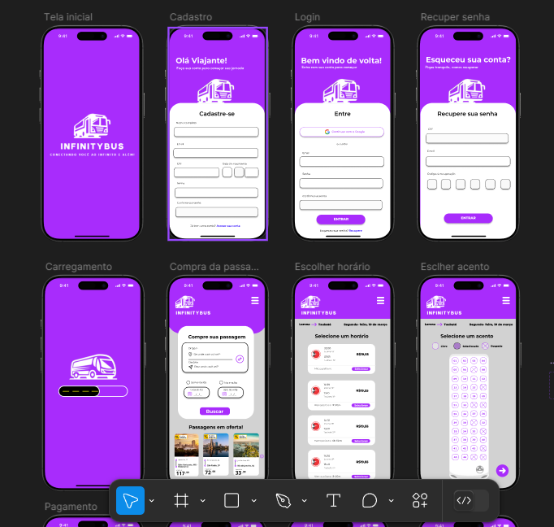
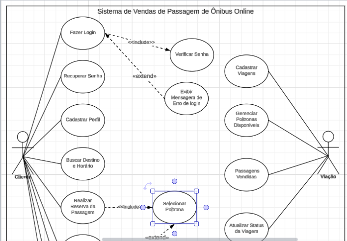
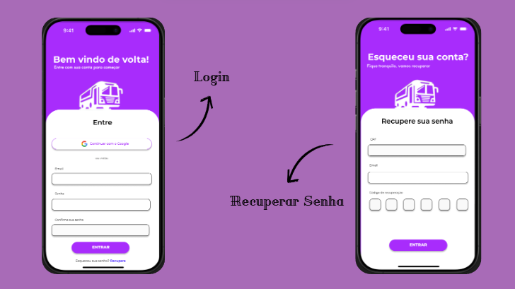

# Projeto InfinityBus

## Sobre o Projeto

Este projeto faz parte de um exercício acadêmico onde desenvolvemos um sistema de vendas de passagens de ônibus online para a empresa **InfinityBus**. O projeto inclui um diagrama de casos de uso, um protótipo interativo no Figma e uma apresentação explicativa.

## Protótipo no Figma

Criamos um protótipo interativo com as telas do aplicativo, destacando as principais funcionalidades do sistema.

  
[🔗 Acesse o Protótipo](https://www.figma.com/design/5rgzVCbHPrEZC3SusK8kED/Telas-InfinityBus?node-id=0-1&p=f&t=pwJbN8yM4BSxJI7w-0)

## Diagrama de Caso de Uso

O diagrama de caso de uso foi desenvolvido no **Lucidchart**, detalhando os atores e suas respectivas funcionalidades no sistema.

  
[🔗 Acesse o Diagrama](https://lucid.app/lucidchart/8ec931ac-46b1-4e24-a03c-85e53632eb81/edit?viewport_loc=-239%2C767%2C1685%2C821%2C0_0&invitationId=inv_2695c26b-5bbc-4871-9d8a-ae6a9f8fd234)

## Apresentação

A apresentação do projeto foi elaborada no **Canva**, explicando os detalhes do sistema e suas funcionalidades.

  
[🔗 Acesse a Apresentação](https://www.canva.com/design/DAGhkKnwtdQ/S1QJJwOz3-kdRQGGB2WIgg/edit)

---
**Desenvolvido por Rafaela Campos** 🚀
